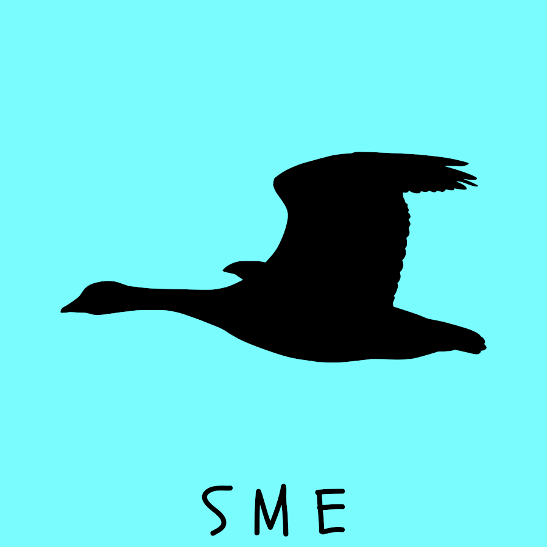

# S1: Foie gras

{style="width:250px"}

[Foie gras](https://en.wikipedia.org/wiki/Foie_gras) is liver of a duck or goose that has been fattened by force feeding (gavage).
It is considered a delicacy of french cuisine.

## Start

> The whirring and vibration of a propeller engine on your back whilst your face braces against the wind.
> Gentle honks can be heard over the engine as geese fly in formation behind you.
> You watch the sun rising over the serene clouds knowing you are in for a long day.

- Setting
    - A clear sky above the american wilderness
- Investigators
    - Flying ultralight aircrafts
    - Guiding migrating geese
    - Each must state how they brave the day’s long and cold flight
    - A relevant failed save (if required) leads to d4 stress
- Escape
    - Leave after their day’s flight

## Middle

> Echoes upon echoes of geese honks as an uncomfortable heat clings onto your crouched form.
> In one hand holds a nozzle attached to a fat and corn caked machine.
> Held by the other, the neck of a goose pinned to the ground between your legs.

- Setting
    - Large foie gras factory farm in France
- Investigators
    - Farm staff
    - Force feeding geese (gavage)
- [Self-inserts](/the_taker_of_thoughts/literary_beings.qmd#self-insert)
    - 3 supervisors encourage and punish unwilling staff
    - Farm staff force feeding geese
- Escape
    - A day’s labour, escape, or revolt

## End

> The scent of fermented grapes, leather, and truffle as red wine is poured.
> The gentle steps of high-class wait staff is barely audible over the melody of polite conversations.
> Looking around you see the candlelit visages of your companions around your table.
> With a sudden flourish the [cloche](https://en.wikipedia.org/wiki/Cloche_(tableware)) before you ascends, revealing a buttery foi gras atop a hawthorn sauce flanked by gold flecked rose petals.

- Setting
    - A french 3-star michelin restaurant
- Investigators
    - Dining at a table together
    - Presented with foie gras
- Foie gras
    - Each investigator that consumes it gains +1 max HP (subsequent servings have no effect)
    - If any investigator eats the foie gras [The Taker of Thoughts](/the_taker_of_thoughts/literary_beings.qmd#the-taker-of-thoughts) gains its feathers feature
- [Self-inserts](/the_taker_of_thoughts/literary_beings.qmd#self-insert)
    - Restaurant staff
    - Diners, some have their heads covered in large napkins eating [Ortolans](https://en.wikipedia.org/wiki/Ortolan_bunting) whole
- Escape
    - Leaving through the restaurant’s entrance is permitted at any time