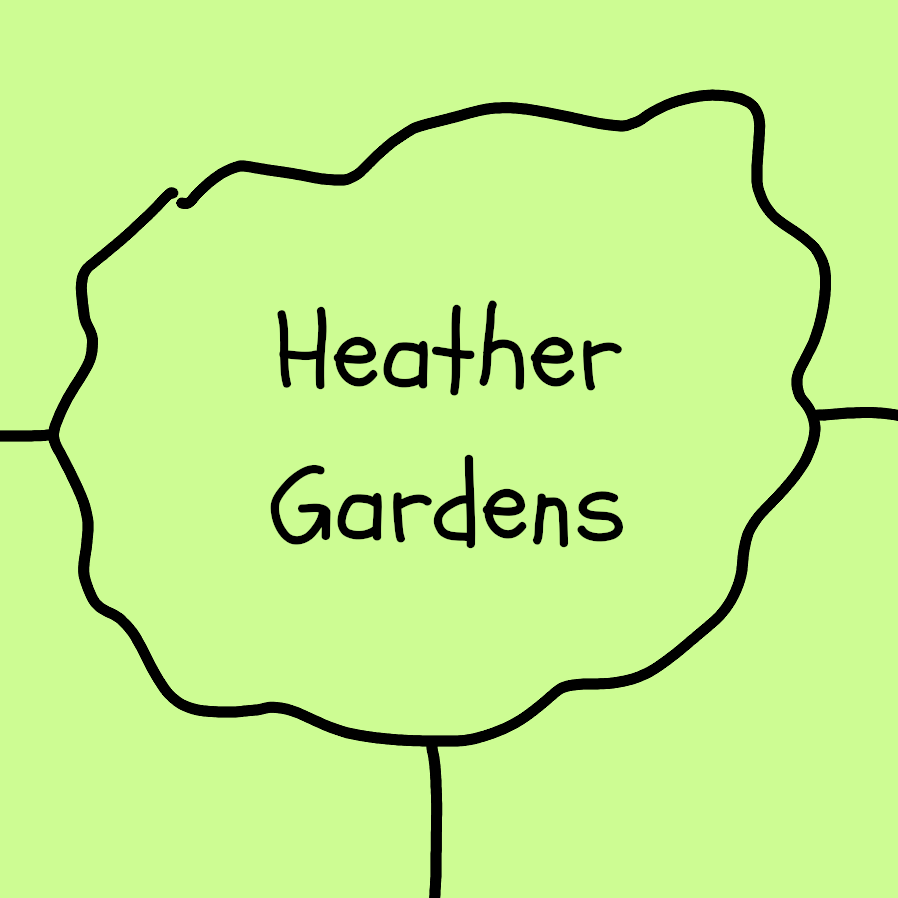
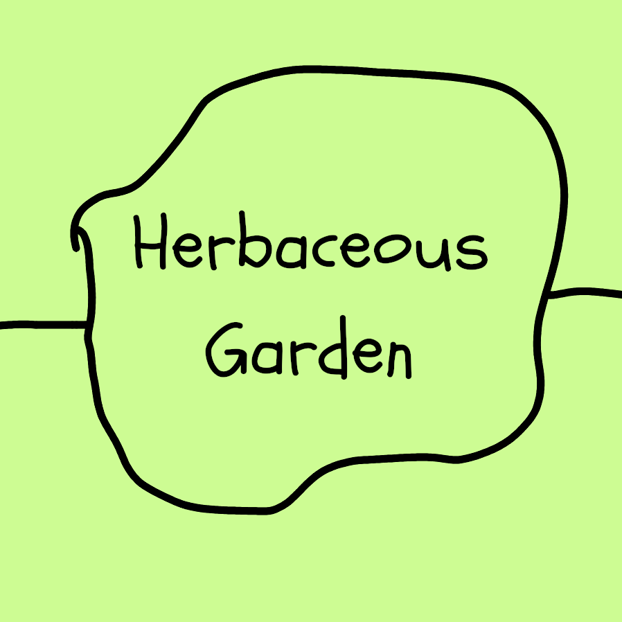
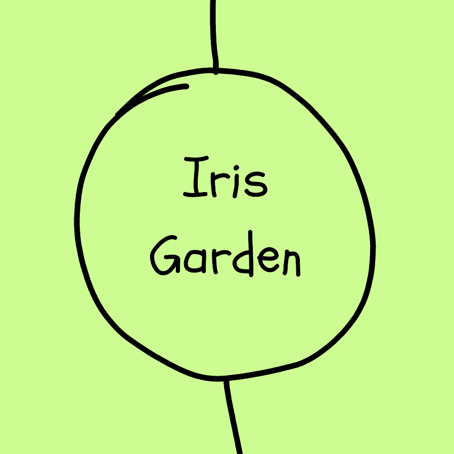
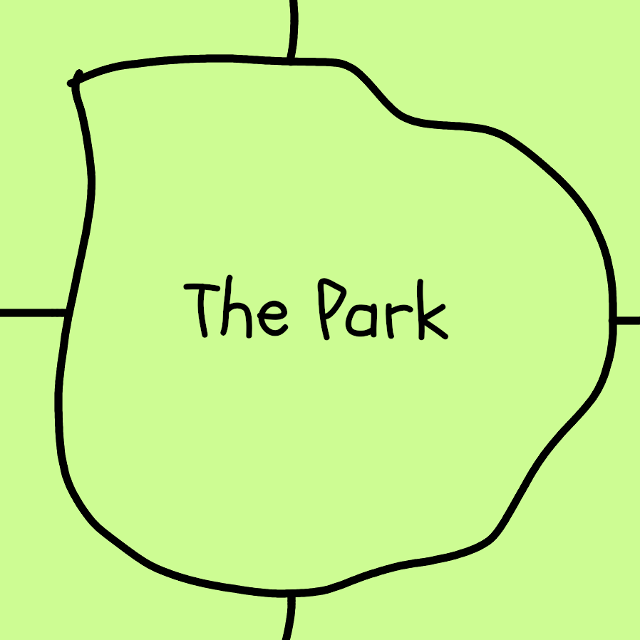
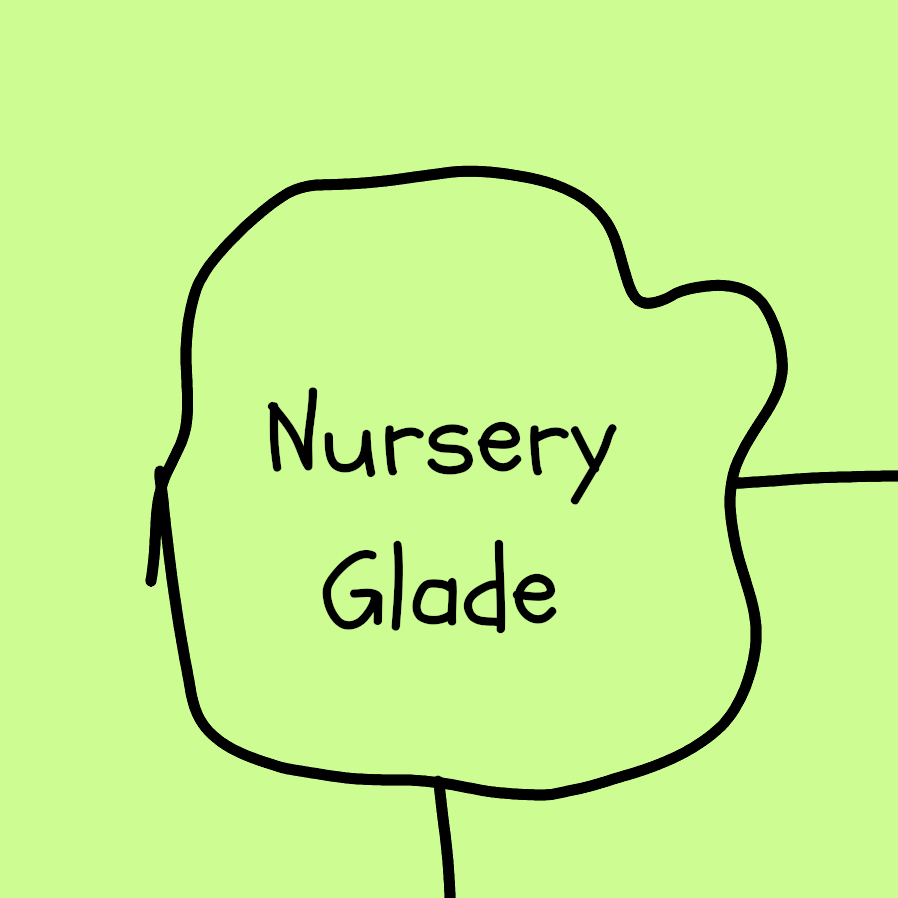
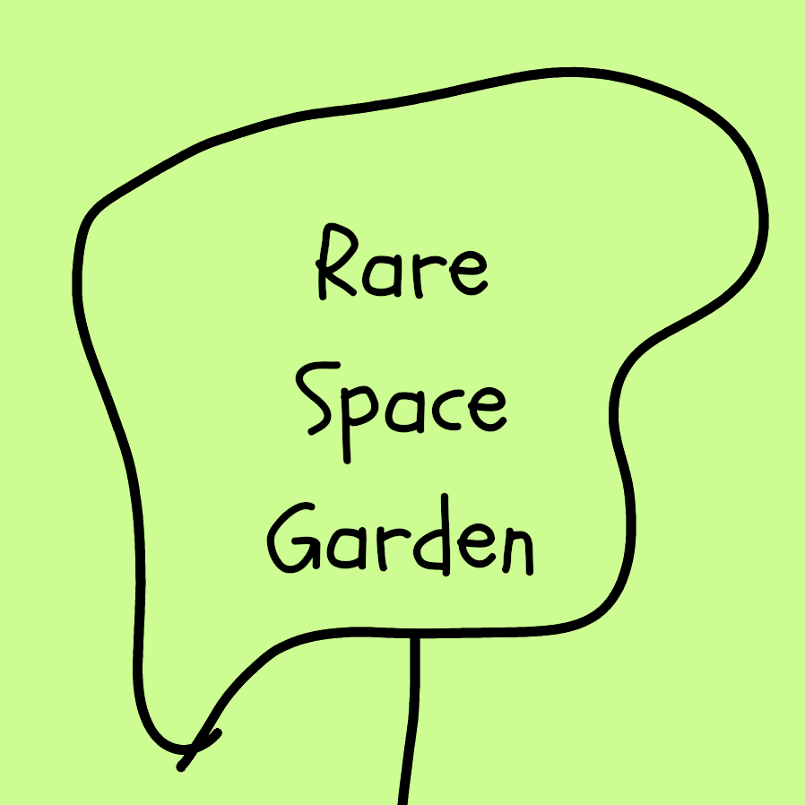
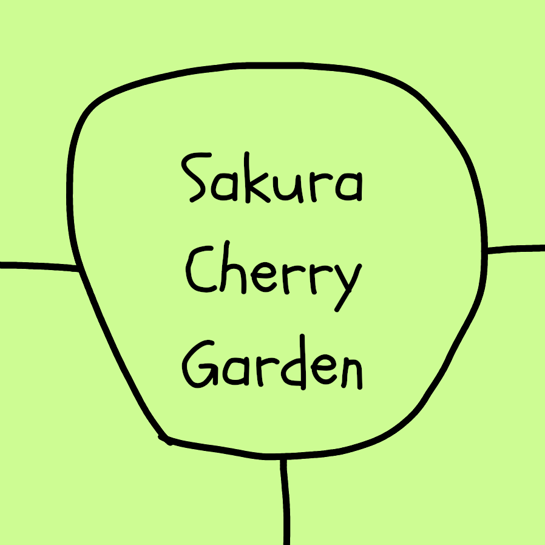
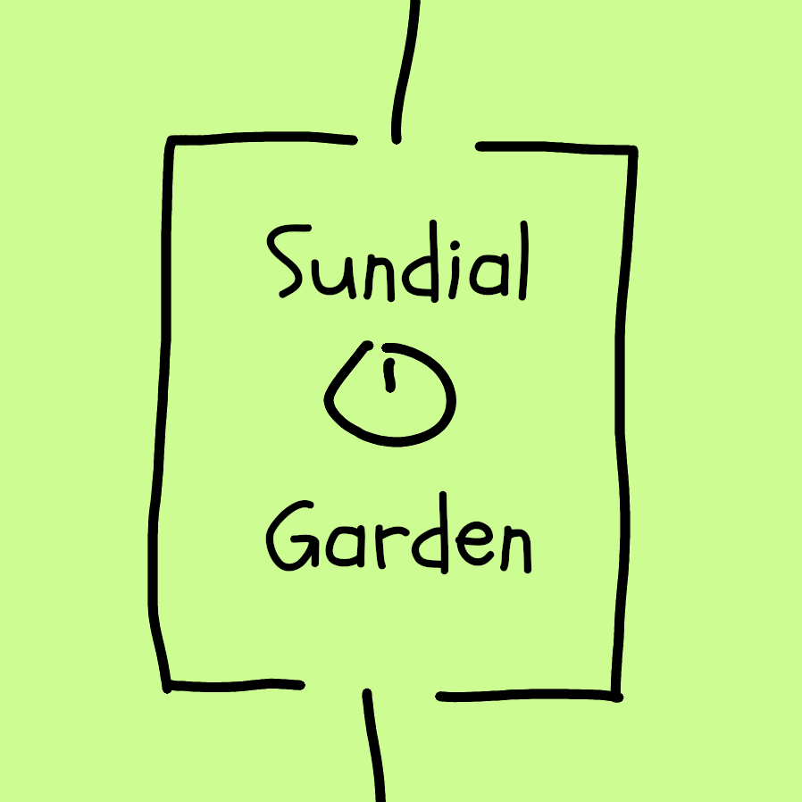
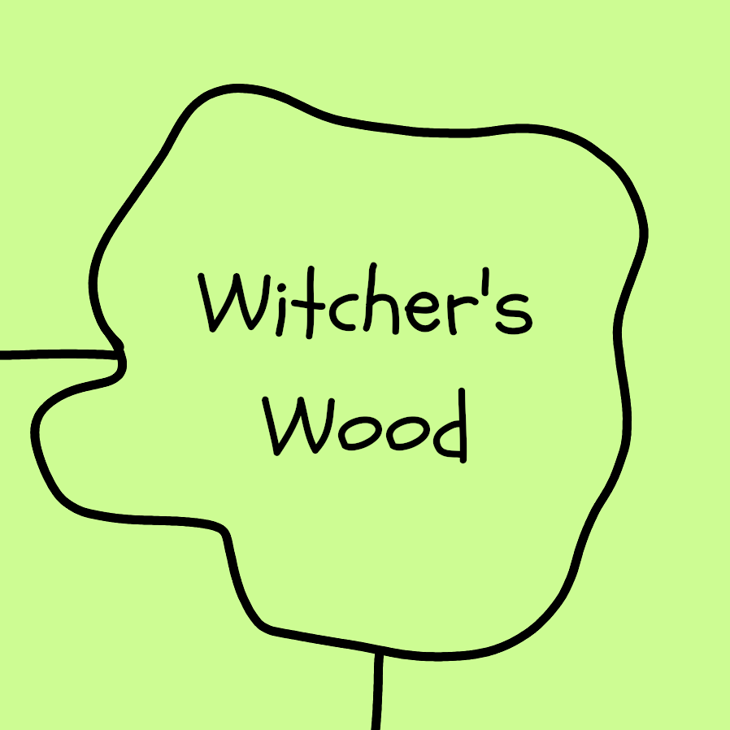

# East locations

The 10 east locations are included within the sticky pool at the start of this sticky crawl.

The focus of this mystery in on the investigator's interactions with [The Guillotined](/the_toll_of_unmeaning/the_guillotined.qmd). Therefore, the descriptions of the locations are deliberately sparse. The facilitator is free to expand these in prep or during play.

East locations cannot directly connect to [West locations]. The East and West are only connected by [Gilbury Bridge](/the_toll_of_unmeaning/bridge.qmd).

## (1) Heather Gardens

+---------------------------------------------+---------------------------------------------------------------------------------------------------------------------------+
| {width="500"} | The smell of heather envelopes the area giving a homely vibe.                                                             |
|                                             |                                                                                                                           |
|                                             | -   Those that rest here heal 1 CTRL (max once). After the rest the investigator can no longer smell any and all heather. |
+---------------------------------------------+---------------------------------------------------------------------------------------------------------------------------+

: {tbl-colwidths="\[35,75\]"}

## (2) Herbaceous Garden

+------------------------------------------------+--------------------------------------------------------------------------------------------------------------------------------------------------------------------------------------------------------------------------------------------+
| {width="500"} | Where there was once herbs, now poppies of red, purple, yellow, and white have conquered the land. The poppies move together as if they share the same dream.                                                                              |
|                                                |                                                                                                                                                                                                                                            |
|                                                | -   Those who haphazardly walk through will find themselves falling asleep (STR save to avoid sleep).                                                                                                                                      |
|                                                | -   If there are no awake investigators to watch/help the investigator will have one of their items stolen by [Rotary Phone Head](/the_toll_of_unmeaning/the_guillotined.qmd#rotary-phone-head) if they are alive and have been activated. |
+------------------------------------------------+--------------------------------------------------------------------------------------------------------------------------------------------------------------------------------------------------------------------------------------------+

: {tbl-colwidths="\[35,75\]"}

## (3) Iris Garden

+------------------------------------------+-------------------------------------------------------------------------------------------------------------------------------------+
| {width="500"} | A large cluster of dark purple irises surrounded by irises of yellow, orange and red forms a perfectly circle garden.               |
|                                          |                                                                                                                                     |
|                                          | -   Slowly the irses will turn to follow the investigators.                                                                         |
|                                          | -   Each investigator will get the strong urge to deeply look at them. Those who do make a CTRL save.                               |
|                                          |     -   Those who failed will have their vision reversed. Their iris will look into their eye instead of outwards (1d4 dex damage). |
|                                          |     -   Vision will mostly return to normal once they leave the iris garden.                                                        |
+------------------------------------------+-------------------------------------------------------------------------------------------------------------------------------------+

: {tbl-colwidths="\[35,75\]"}

## (4) The Park

+---------------------------------------+----------------------------------------------------------------------------------------------------------------------------------------------------------------------+
| {width="500"} | A large open space of grass with scatterings of trees. It is darker than the rest of the gardens as a pitch black sky hangs above with no sign of the moon or stars. |
|                                       |                                                                                                                                                                      |
|                                       | -   For those who watch the sky they will hear the sound of a bell come from space.                                                                                  |
|                                       | -   It will ring 7 times, each time a new star appears forming a constellation in the shape of a bell. Those who hear all seven rings suffer 1 stress.               |
+---------------------------------------+----------------------------------------------------------------------------------------------------------------------------------------------------------------------+

: {tbl-colwidths="\[35,75\]"}

## (5) Nursery Glade

+--------------------------------------------+----------------------------------------------------------------------------------------------------------------------------------------+
| {width="500"} | Approaching the flower nursery they hear the sound of a screaming baby from its centre.                                                |
|                                            |                                                                                                                                        |
|                                            | -   The source is a fox, all its fur replaced by red petals (1d4 stress).                                                              |
|                                            | -   It will run off screaming whilst leaving a trail of petals.                                                                        |
|                                            | -   If followed it will be found being strangled by [Rotary Phone Head](/the_toll_of_unmeaning/the_guillotined.qmd#rotary-phone-head). |
+--------------------------------------------+----------------------------------------------------------------------------------------------------------------------------------------+

: {tbl-colwidths="\[35,75\]"}

## (6) Oxbury House

+-------------------------------------------+------------------------------------------------------------------------------------------------------------------------------------------------------------------------------------------------------------------------------------+
| {width="500"} | A grainy cacophony loudly plays from the 13th century Manor house. It only becomes louder and more disorienting within its maze like halls where the walls are covered with portraits of individuals each head replaced by a bell. |
|                                           |                                                                                                                                                                                                                                    |
|                                           | -   [Gramophone Head](/the_toll_of_unmeaning/the_guillotined.qmd#gramophone-head) can be found alone in a massive ballroom attempting to drink whiskey and smoke a cigar.                                                          |
+-------------------------------------------+------------------------------------------------------------------------------------------------------------------------------------------------------------------------------------------------------------------------------------+

: {tbl-colwidths="\[35,75\]"}

## (7) Rare Space Garden

+------------------------------------------------+----------------------------------------------------------------------------------------------------------------------------------+
| {width="500"} | A lovely space for individuals with dementia to relax in the gardens.                                                            |
|                                                |                                                                                                                                  |
|                                                | -   [Rotary Phone Head](/the_toll_of_unmeaning/the_guillotined.qmd) is waiting here, they will hide when investigators approach. |
|                                                | -   From then on Rotary phone head is activated and will stalk the investigators, attempting to ambush one when they are alone.  |
+------------------------------------------------+----------------------------------------------------------------------------------------------------------------------------------+

: {tbl-colwidths="\[35,75\]"}

## (8) Sakura Cherry Garden

+---------------------------------------------------+--------------------------------------------------------------------------------------------------------------------------------------------------------------------------------+
| {width="500"} | A solemn location where cherry blossom petals slowly but constantly fall.                                                                                                      |
|                                                   |                                                                                                                                                                                |
|                                                   | -   As each petal hits the ground it becomes a miniature petal origami human which goes through an entire life through the period of a minute.                                 |
|                                                   | -   Once the petal human dies it rises back up to the cherry tree as a seemingly normal petal only to go through the cycle once more.                                          |
|                                                   | -   The first petal taken by an investigator becomes frozen in time. It is now a memento with 1 stability. Further petals shrivel and lies still with all its potential taken. |
+---------------------------------------------------+--------------------------------------------------------------------------------------------------------------------------------------------------------------------------------+

: {tbl-colwidths="\[35,75\]"}

## (9) Sundial Garden

+---------------------------------------------+-------------------------------------------------------------------------------------------------------------------------------------------------------------------------------------------------------------+
| {width="500"} | A garden surrounded by large manicured yew hedges. Investigating and appreciating the griffin topped sundial is the friendly [Typewriter Head](/the_toll_of_unmeaning/the_guillotined.qmd#typewriter-head). |
+---------------------------------------------+-------------------------------------------------------------------------------------------------------------------------------------------------------------------------------------------------------------+

: {tbl-colwidths="\[35,75\]"}

## (10) Witcher’s Wood

+--------------------------------------------+-------------------------------------------------------------------------------------------------------------------------------------------------------------------+
| {width="500"} | A once peaceful wood has become overgrown with thick razor sharp brambles. Walking the path to its side the sounds of crumbling trees can be heard from within.   |
|                                            |                                                                                                                                                                   |
|                                            | -   Lone investigators will be ambushed by [Rotary Phone Head](/the_toll_of_unmeaning/the_guillotined.qmd#rotary-phone-head), if alive, when they are alone here. |
|                                            | -   Investigators must roll a CTRL save or become separated from other investigators.                                                                             |
+--------------------------------------------+-------------------------------------------------------------------------------------------------------------------------------------------------------------------+

: {tbl-colwidths="\[35,75\]"}