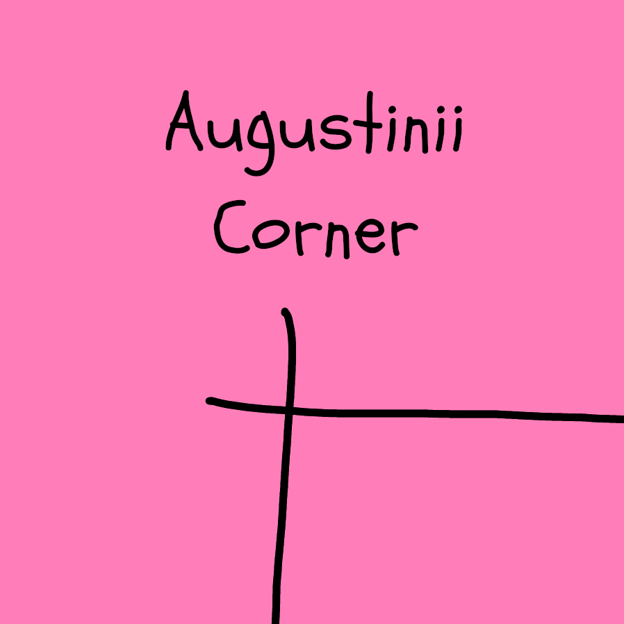
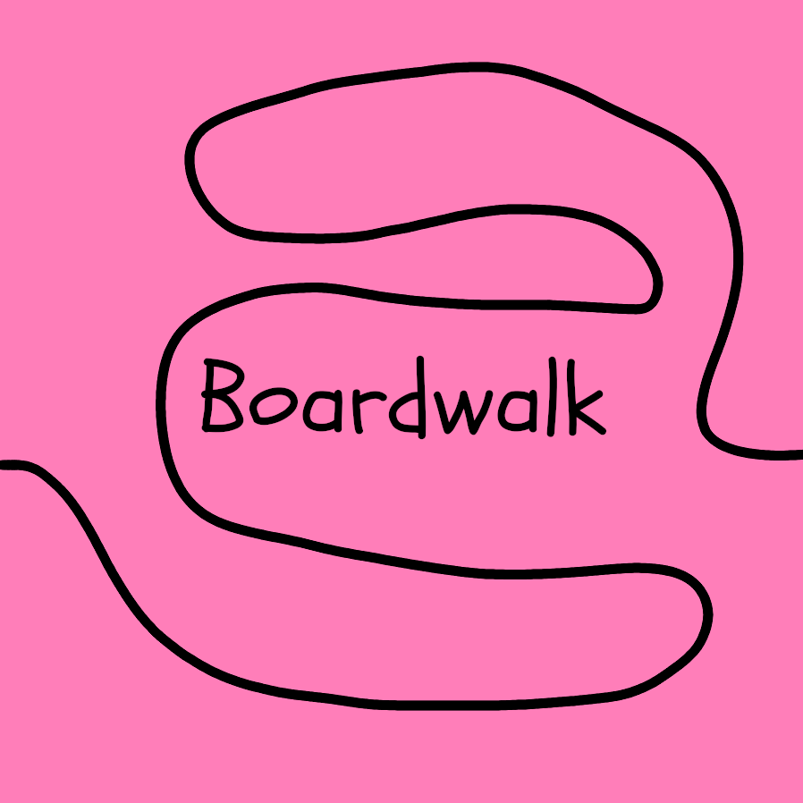
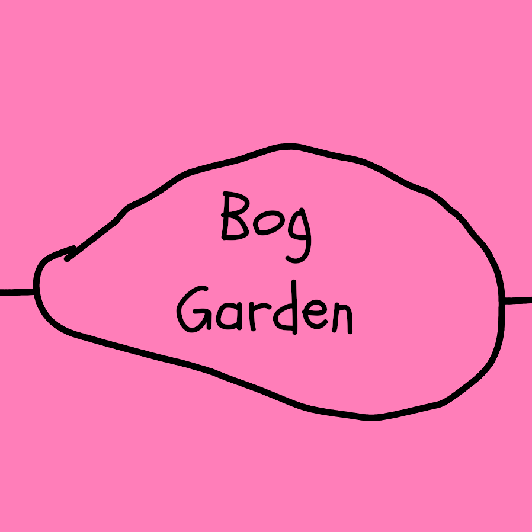
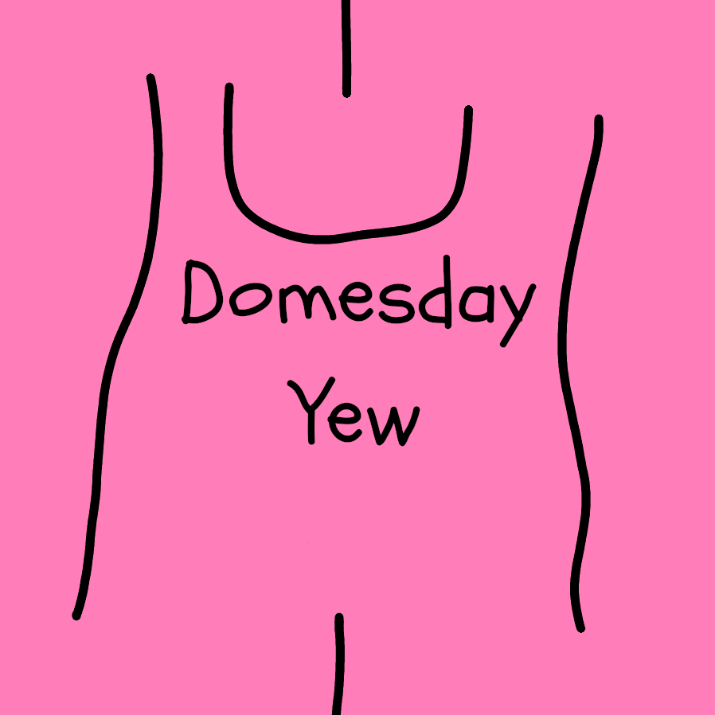
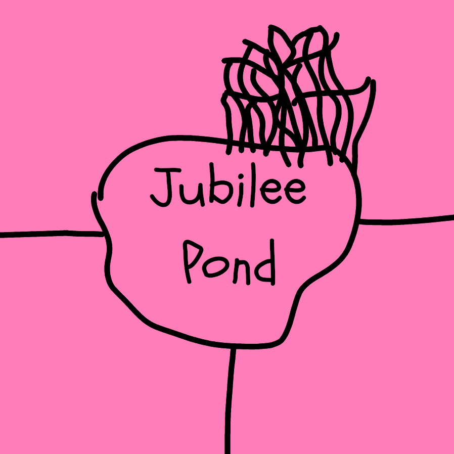
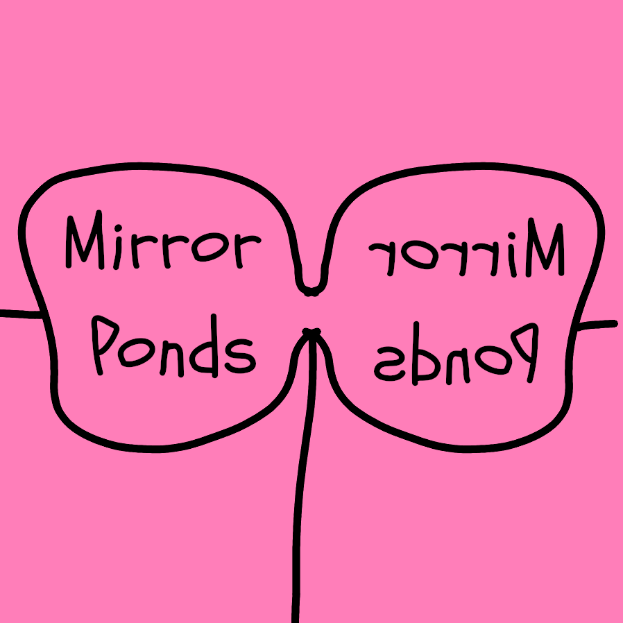
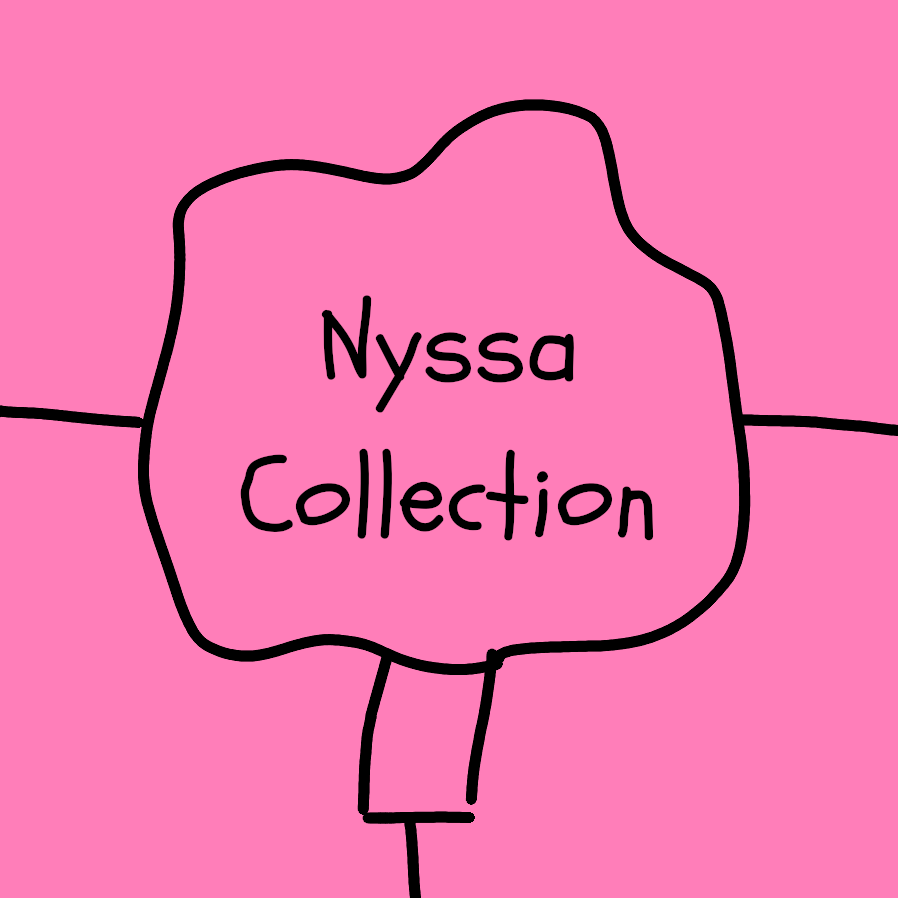
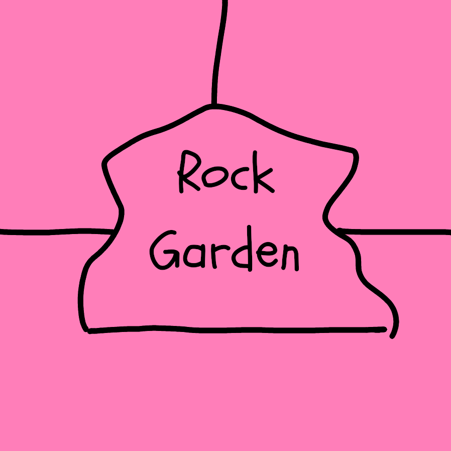
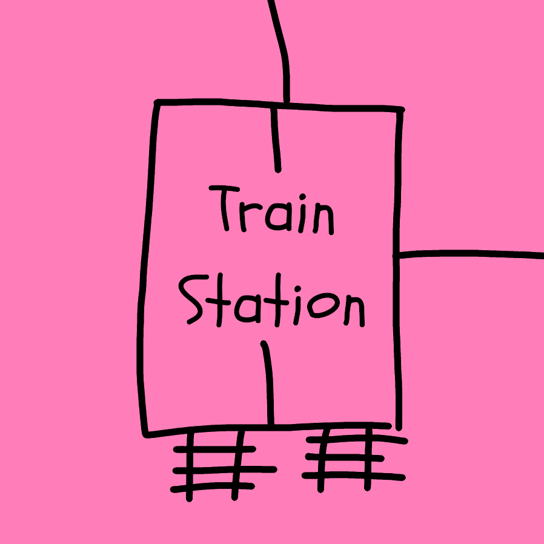

# West locations

The train line goes through this area. The train is constantly on the move, only briefly stopping at central station. Only glimpses of the train can be seen through the steam its constantly blowing whistle emits.

The 10 west locations can only be accessed through the [Gilbury Bridge](/the_toll_of_unmeaning/bridge.qmd) location and other West locations. East locations cannot directly connect to West locations.

### (1) Augustinii corner

+------------------------------------------------+-------------------------------------------------------------------------------------------------------------------------------------------------------------------------------------------------------------------------------------------------------------------------------------------------------------------------------------+
| {width="500"} | An intersection of 2 paths, a part of the gardens forgotten by visitors and staff alike. The vegetation encroaches onto the paths leading to 2 dead ends. [Chalkboard head](/the_toll_of_unmeaning/the_guillotined.qmd#chalkboard-head) crouches here, failing to gather his thoughts through the sound of his scraping chalkboard. |
+------------------------------------------------+-------------------------------------------------------------------------------------------------------------------------------------------------------------------------------------------------------------------------------------------------------------------------------------------------------------------------------------+

: {tbl-colwidths="\[35,75\]"}

### (2) Boardwalk

+----------------------------------------+----------------------------------------------------------------------------------------------------------+
| {width="500"} | A curling boardwalk over a dreaded bog. Whispers of dead loved ones will speak in decipherable noises.   |
|                                        |                                                                                                          |
|                                        | -   When traversing make a CTRL save.                                                                    |
|                                        |     -   Success: Traverse the boardwalk and they teleport to their final destination within the gardens. |
|                                        |     -   Failure: d4 stress or go back to the start of the Boardwalk.                                     |
+----------------------------------------+----------------------------------------------------------------------------------------------------------+

: {tbl-colwidths="\[35,75\]"}

### (3) Bog Garden

+-----------------------------------------+-----------------------------------------------------------------------------------------------------------------------------------------------------------------------------------------------------------------+
| {width="500"} | The Bog Gardens are obscured in a steam mist produced by [Steam Whistle Head]((/the_toll_of_unmeaning/the_guillotined.qmd)).                                                                                    |
|                                         |                                                                                                                                                                                                                 |
|                                         | -   It is difficult to find [Steam Whistle Head](/the_toll_of_unmeaning/the_guillotined.qmd#steam-whistle-head) as their whistle echoes in the mist and the poor visibility makes navigating the bog dangerous. |
+-----------------------------------------+-----------------------------------------------------------------------------------------------------------------------------------------------------------------------------------------------------------------+

: {tbl-colwidths="\[35,75\]"}

### (4) Domesday yew

+-------------------------------------------+----------------------------------------------------------------------------------------------------------------------------------------+
| {width="500"} | Amongst the trees and foliage stands out the Domesday yew. Where once a gnarled and hollow tree stood now stands a massive yew treant. |
|                                           |                                                                                                                                        |
|                                           | -   The treant will talk and try to persuade people to come closer.                                                                    |
|                                           | -   It is rooted in place but grabs anything moving within its reach, raising it to its mouth to eat.                                  |
|                                           | -   It will not chew, instead only swallowing.                                                                                         |
|                                           | -   Soon the unlucky morsel will fall out the bottom of the treant suffering d6 damage and the treant will be satisfied momentarily.   |
+-------------------------------------------+----------------------------------------------------------------------------------------------------------------------------------------+

: {tbl-colwidths="\[35,75\]"}

### Yew treant

**STR**: 16 **DEX**: 6 **CTRL**: 8  **HP**: 8 **ARMOR**: 2

Consume (d6) Pummel (d8 + d8)

-   A treant born from a 300 year old hollow yew tree
-   Acts friendly to try to entice people to come closer
-   Has a terrible hunger it can never be rid of

### (5) Dragonfly Pond

+---------------------------------------------+--------------------------------------------------------------------------------------------------------------------------------------------------------------------------------------------------------------------+
| {width="500"} | Static washes through the area as [CRT TV Head](/the_toll_of_unmeaning/the_guillotined.qmd#crt-tv-head) looks over the pond. Moths buzz around their head as dragonflies fly in and out of the light hunting them. |
+---------------------------------------------+--------------------------------------------------------------------------------------------------------------------------------------------------------------------------------------------------------------------+

: {tbl-colwidths="\[35,75\]"}

### (6) Jubilee Pond

+-------------------------------------------+--------------------------------------------------------------------------------------------------------------------+
| {width="500"} | Weeping willows reflect off the still surface of the pond. The long dangling branches sway in in the absence wind. |
|                                           |                                                                                                                    |
|                                           | -   The branches of the trees sink into the water, they grab and attempt to drown the vain.                        |
+-------------------------------------------+--------------------------------------------------------------------------------------------------------------------+

: {tbl-colwidths="\[35,75\]"}

### (7) Mirror Ponds

+-------------------------------------------+------------------------------------------------------------------------------------------------------------------------------------------------------------------------------------------+
| {width="500"} | 2 identical ponds lie at the end of a stream.                                                                                                                                            |
|                                           |                                                                                                                                                                                          |
|                                           | -   Each pond reflects the image the other pond should.                                                                                                                                  |
|                                           | -   If [Rotary Phone Head](/the_toll_of_unmeaning/the_guillotined.qmd#rotary-phone-head) is still on the loose he will be easily spotted lurking in the trees through these reflections. |
+-------------------------------------------+------------------------------------------------------------------------------------------------------------------------------------------------------------------------------------------+

: {tbl-colwidths="\[35,75\]"}

### (8) Nyssa collection

+-----------------------------------------------+----------------------------------------------------------------------------------------------+
| {width="500"} | A collection of red leafed Nyssa trees surround this three way intersection.                 |
|                                               |                                                                                              |
|                                               | -   When entering the intersection a gale picks up and the leaves envelop the investigators. |
|                                               | -   Afterwards, randomly determine which way the investigators leave.                        |
+-----------------------------------------------+----------------------------------------------------------------------------------------------+

: {tbl-colwidths="\[35,75\]"}

### (9) Rock Garden

+------------------------------------------+------------------------------------------------------------------------------------------------------------------------------------------------------+
| {width="500"} | A garden full of life and rocks. In the centre stands an upright log with a golden bell.                                                             |
|                                          |                                                                                                                                                      |
|                                          | -   As the investigators traverse the rock garden the rocks shift and grind the trees, plants and log down into the earth.                           |
|                                          | -   The investigators can retreat safely or attempt to grab the bell before it is swallowed by the rocks.                                            |
|                                          | -   Example: To grab the bell make a DEX save                                                                                                        |
|                                          |     -   Success = Grab Golden bell (deals d6 stress to otherworld entities/monsters and the transformed, those with 3 or more fallouts)              |
|                                          |     -   Failure = suffer d6 damage.                                                                                                                  |
|                                          | -   If the investigators return to this location it looks like it once did before the destruction and will remain stable, but their will be no bell. |
+------------------------------------------+------------------------------------------------------------------------------------------------------------------------------------------------------+

: {tbl-colwidths="\[35,75\]"}

### (10) Train Station

+--------------------------------------------+----------------------------------------------------------------------------------------------------------------------------------------------+
| {width="500"} | A small train station for a small steam train. When the foot wide train arrives it spits out steam and screams a whistle of pain.            |
|                                            |                                                                                                                                              |
|                                            | -   Whilst driving the train, the investigator can make it stop at any West location. The train restarts once investigators have jumped off. |
|                                            |                                                                                                                                              |
|                                            | -   Jumping onto the train from other locations is dangerous due to the scalding hot steam surrounding it.                                   |
+--------------------------------------------+----------------------------------------------------------------------------------------------------------------------------------------------+

: {tbl-colwidths="\[35,75\]"}